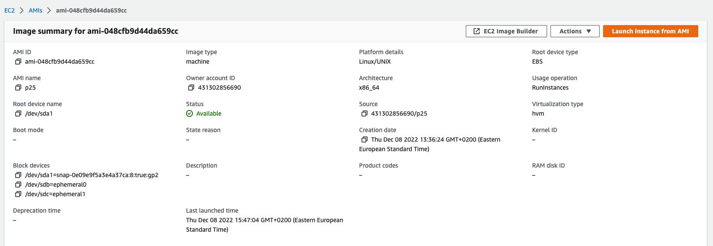
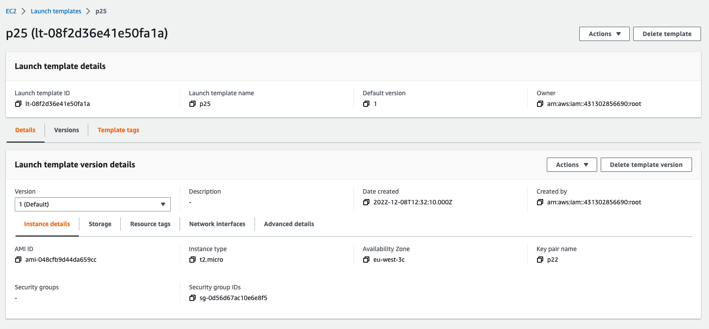
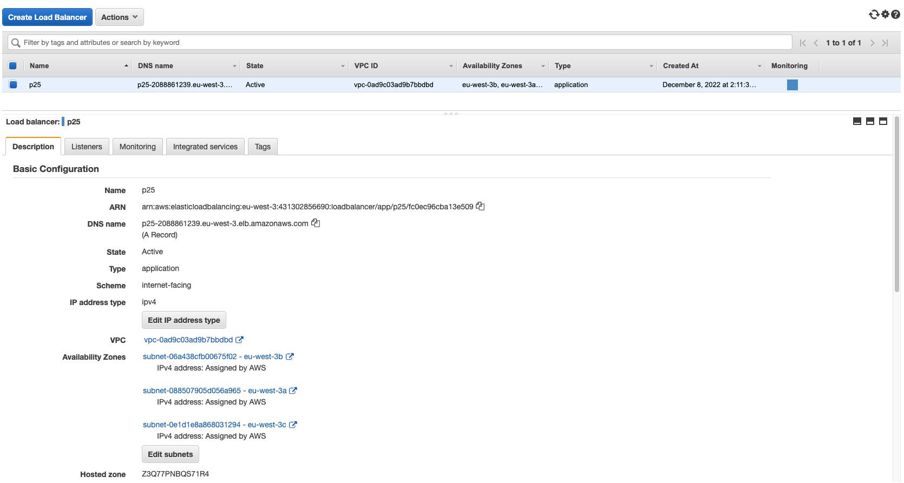
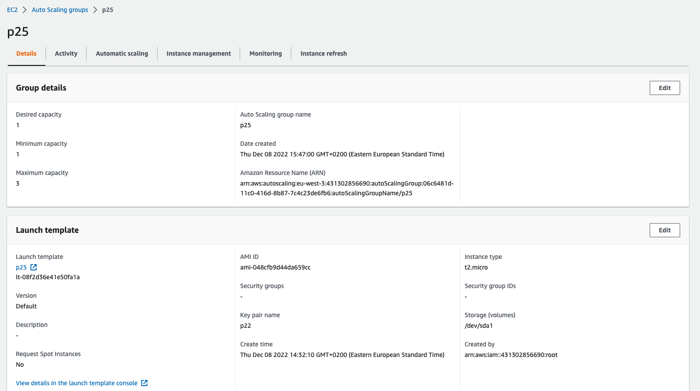
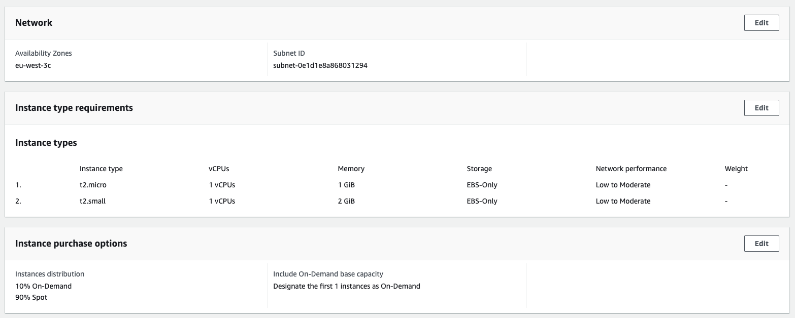
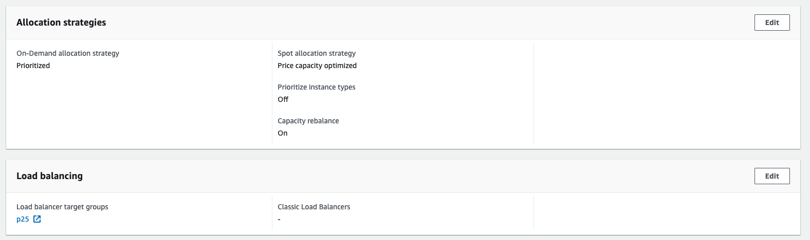
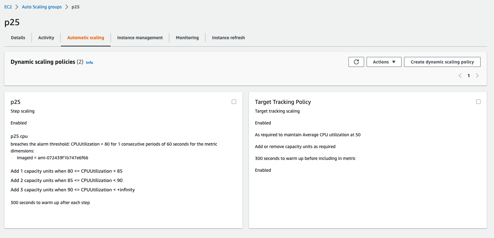
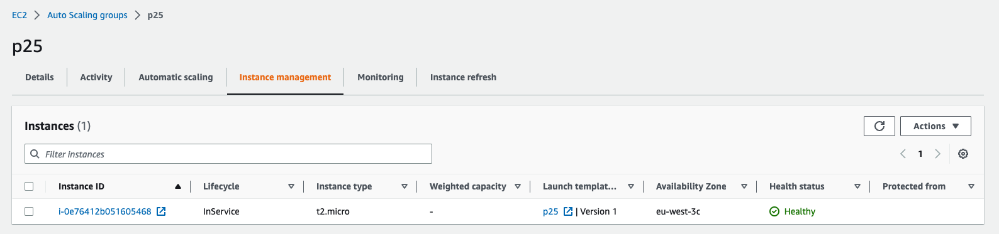

# Autoscale Group

Using the AWS Management Console created the AMI 

and Launch template from the existing EC2 instance. 

Created Load balancer

Configured autoscale group

with the following autoscale config

As a result got an autoscale group with a running instance

